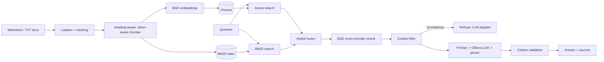

# RAGForge

Production-ready technical knowledge assistant: a LangChain RAG pipeline with hybrid retrieval, BGE reranking, cited answers that refuse when evidence is missing, and a measured evaluation.

## Features

- **Hybrid retrieval**: `alpha * dense + (1 - alpha) * bm25` over min-max normalized scores
- **Vector search**: BGE embeddings in a LangChain `Chroma` store
- **BM25**: LangChain `BM25Retriever` with an identifier-aware tokenizer (`num_workers` matches `num_workers`, `num` and `workers`)
- **BGE reranking**: cross-encoder (`bge-reranker-base`) as an independent module
- **Citation-aware generation**: numbered passages, `[n]` citations validated mechanically
- **Hallucination protection**: reranker-score evidence gate (LLM not called without evidence), context-only prompt with an exact refusal sentence, invalid citations stripped
- **RAG evaluation**: Recall@K, MRR, context relevance, NLI faithfulness, answer relevance, refusal rates
- **FastAPI** service and **Streamlit** dark UI with a pipeline debug mode
- **Local LLM** via Ollama; any OpenAI-compatible server via config

## Architecture



## Pipeline

1. **Ingestion**: load Markdown/TXT, clean MyST/Sphinx markup, split on headings (code-fence aware), then token-aware recursive splitting (`CHUNK_SIZE`/`CHUNK_OVERLAP` in BGE tokens). Every chunk starts with its section path and carries `source`, `document`, `section`, `chunk_id`, `page`.
2. **Embedding**: `BAAI/bge-small-en-v1.5`, normalized; queries get BGE's instruction prefix.
3. **Dense retrieval**: top `TOP_K_DENSE` from Chroma (cosine).
4. **BM25**: top `TOP_K_BM25` lexical hits.
5. **Hybrid search**: union of candidates, each scored by *both* retrievers, min-max normalized, fused with `HYBRID_ALPHA`; keep `TOP_K_HYBRID`.
6. **Reranking**: cross-encoder scores (query, chunk) pairs; keep `TOP_K_RERANKED`.
7. **Context filtering**: drop scores below `MIN_RERANK_SCORE`, near-duplicates, and anything over `MAX_CONTEXT_TOKENS`; every drop is reported with a reason.
8. **LLM**: LCEL chain `ChatPromptTemplate | chat model | StrOutputParser`.
9. **Citation**: `[n]` markers are checked against the passages actually shown; unknown ones are removed and flagged.

## Installation

Requires Python 3.12.

```bash
git clone git@github.com:martybin/RAGForge.git && cd RAGForge
python3.12 -m venv .venv && source .venv/bin/activate
pip install torch==2.14.1 --index-url https://download.pytorch.org/whl/cpu   # CPU-only build; skip for GPU
pip install -r requirements.txt
pip install -e . --no-deps
cp .env.example .env
```

## Running locally

```bash
# 1-2. venv + dependencies: see above
# 3-4. Ollama (separate process, https://ollama.com) and a model
ollama serve &
ollama pull qwen2.5:3b            # must match LLM_MODEL in .env
# 5. knowledge base + index (downloads 23 PyTorch v2.14.1 doc pages, builds the index)
python scripts/download_docs.py
python scripts/ingest.py
# 6. API
uvicorn api.main:app --port 8000
# 7. UI (another terminal)
streamlit run ui/streamlit_app.py
```

Docker (Ollama stays on the host): `docker compose run --rm ingest && docker compose up api ui`.

Reasoning models such as `qwen3` think before answering; set `LLM_THINK=false` for CPU use.

## Evaluation

`python scripts/evaluate.py` runs `evaluation/questions.json` (42 answerable questions with expected answers and relevant sources, plus 8 unanswerable ones) and writes every per-question record to `evaluation/results/latest.json`.

- **Recall@K**: share of relevant source files found in the top K chunks. **MRR@5**: mean reciprocal rank of the first relevant chunk.
- **Context relevance**: share of final-context chunks from a relevant source.
- **Faithfulness**: share of answer statements entailed by a context passage, judged by `cross-encoder/nli-deberta-v3-base` (NLI, not an LLM).
- **Answer relevance**: the LLM reconstructs the question from the answer; cosine similarity (BGE) with the real question. The judge LLM is the same model that generates answers.
- **Refusal rates**: correct refusal on unanswerable questions, false refusal on answerable ones.

RESULTS_PLACEHOLDER

## Example

RESULTS_EXAMPLE

## Project structure

```
app/
  config/        settings.py (env config), logging_config.py
  ingestion/     cleaning.py, loaders.py, chunker.py, indexer.py
  retrieval/     vector_search.py, bm25_search.py, hybrid_search.py, reranker.py, context_filter.py
  generation/    prompts.py, llm.py, generator.py, citations.py
  pipeline/      rag_pipeline.py
  evaluation/    dataset.py, metrics.py, judges.py, runner.py
  models/        schemas.py
  embeddings.py, storage.py
api/main.py      FastAPI service
ui/streamlit_app.py
scripts/         download_docs.py, ingest.py, evaluate.py
evaluation/      questions.json, results/
tests/           pytest suite (no model downloads, no LLM needed)
```

Run the tests with `pytest`.

## Future improvements

Query rewriting, multi-query retrieval, parent-child retrieval, PDF/HTML loaders, Graph RAG, agentic RAG, observability (tracing), larger and human-verified evaluation sets, Ragas-style LLM judges with a stronger evaluator model.
